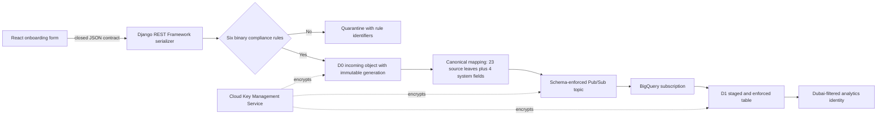

# Secure Student Onboarding Deployment and Automation Blueprint

Author: Pritam Raha  
Contact: rahapritam32@gmail.com  
Assignment: Junior Cloud and DevOps Engineer (Google Cloud, Django, React)  
Submission date: 3 August 2026

This repository is a deployable, fail-closed response to the HabotConnect staging incident. It replaces embedded credentials with workload identities, protects raw and staged data with customer-managed encryption, rejects schema drift before publication, and makes an insecure commit incapable of authorising a release.

## Outcome

| Assignment requirement | Delivered evidence |
|---|---|
| Secure D0 raw landing bucket | `infrastructure/modules/secure_data_landing/main.tf`: public access prevention, uniform access, encryption, versioning, retention, soft deletion, access logs, and prefix-conditioned object creation |
| D1 staged and enforced dataset | BigQuery dataset and partitioned table with customer-managed encryption and deletion protection |
| Strict Identity and Access Management | Separate ingestion, validation, analytics, and Google-managed service identities; no service-account keys; narrow predefined roles |
| Row-level security | Pipeline full-access policy plus a Dubai-only analytics policy, both managed as Terraform resources |
| Schema-safe streaming | One 27-field contract checked across Avro, Pub/Sub, canonical Python mapping, and BigQuery |
| Fail-closed pipeline | GitHub Actions stops on secret, dependency, format, lint, test, Terraform, or policy failure; failed runs upload quarantine evidence and never emit release authorisation |
| Deconstruction of Compliance into Yes or No | Six atomic binary rules, strict JSON booleans, closed serializers, exact bounds, cross-field validation, and automated tests |
| Presentation and schema worksheet | `submission/Pritam_Raha_Engineering_Blueprint.pptx` and `submission/Pritam_Raha_Schema_Mapping.xlsx` |
| Single upload package | `submission/Pritam_Raha_Junior_Cloud_DevOps_Assignment.zip` with checksum manifest |

## Architecture



The complete trust-boundary analysis is in [architecture/architecture.md](architecture/architecture.md).

## Run the evidence locally

Prerequisites: Python 3.12, Terraform 1.14 or later, and internet access for the first dependency and provider installation.

```bash
make install
make validate
```

The strict negative demonstration is independently runnable:

```bash
make demo-fail-closed
```

For a requirement-by-requirement checklist covering local, GitHub, and optional live Google Cloud tests, use [docs/manual-verification-guide.md](docs/manual-verification-guide.md). The serializer's accepted and rejected paths can be demonstrated with `make demo-data-validation`; after deployment, live Pub/Sub test fixtures can be generated with `RAW_BUCKET="$(terraform -chdir=infrastructure output -raw raw_landing_bucket)" make generate-cloud-test-events`.

Expected result:

```text
Fail-closed demonstration: PASSED — a synthetic hardcoded credential produced 1 finding and a non-deployable result.
```

The demonstration creates the insecure content only in a temporary directory, verifies rejection, then removes it. No credential-like example is committed to the repository.

## Deploy safely

The configuration intentionally has no embedded Google Cloud project, user credential, or service-account key. Authentication uses Google Application Default Credentials; deployment-specific input uses Terraform variables.

```bash
export TF_VAR_project_id="habot-staging-pritam-raha-2026"
export TF_STATE_BUCKET="habot-staging-pritam-raha-2026-terraform-state"
gcloud auth application-default login
terraform -chdir=infrastructure init -backend-config="bucket=${TF_STATE_BUCKET}"
terraform -chdir=infrastructure plan -out=staging.tfplan
terraform -chdir=infrastructure apply staging.tfplan
```

Before the first command, an authorised platform administrator creates the dedicated state bucket using the controls in [docs/deployment-runbook.md](docs/deployment-runbook.md). The project identifier shown is a submission-specific example; `project_id` has no default, so Terraform cannot silently target a project.

## Live staging verification

The blueprint was deployed and verified end to end on 1 August 2026 in the dedicated `habot-staging-pritam-raha-2026` project. Storage allow-and-deny checks, Pub/Sub schema rejection, BigQuery delivery, row-level filtering, customer-managed encryption, destruction resistance, and a zero-drift Terraform plan all passed. The existing `outloop-email-backend` project was not targeted. See [docs/deployment-evidence.md](docs/deployment-evidence.md) for the recorded results and presentation sequence.

## Repository guide

```text
backend/                 Django model, serializer, binary rules, canonical mapper, tests
contracts/               Avro Pub/Sub and BigQuery single-purpose data contracts
infrastructure/          Root Terraform, reusable secure data landing module, plan tests
.github/workflows/       Fail-closed quality and security gate
scripts/                 Contract check, secret detector, negative demo, artifact builder
tests/                   Independent security-gate tests
docs/                    Runbook, gate logic, data contract, evidence, decisions
submission/              Final presentation and wrapped schema workbook
```

## Design boundaries

- This assignment provisions staging data infrastructure, not the React or Django runtime. Application deployment is therefore outside the Terraform apply surface.
- A release-authorisation job is emitted only after every gate passes. Production infrastructure apply remains a separately approved action because this repository has no authority over an employer-owned Google Cloud project.
- The access-log bucket has one documented Checkov exception: it is the terminal logging destination and must not recursively log into itself.
- Row-level filtering is demonstrated with a dedicated analytics service account. In production, a Google Group mapped to the same policy is preferable for human analysts.
- Raw objects are immutable by permission: the ingestion identity has `storage.objectCreator`, not read, update, list, or delete access.

## Authoritative references

- [Cloud Storage Identity and Access Management conditions](https://cloud.google.com/storage/docs/access-control/iam)
- [BigQuery row-level security](https://cloud.google.com/bigquery/docs/managing-row-level-security)
- [BigQuery row-level security best practices](https://cloud.google.com/bigquery/docs/best-practices-row-level-security)
- [BigQuery customer-managed encryption keys](https://cloud.google.com/bigquery/docs/customer-managed-encryption)
- [Terraform Google BigQuery row access policy resource](https://registry.terraform.io/providers/hashicorp/google/latest/docs/resources/bigquery_row_access_policy)
- [GitHub Actions secure use reference](https://docs.github.com/en/actions/security-for-github-actions/security-guides/security-hardening-for-github-actions)
# HabotGCP_Assignment
